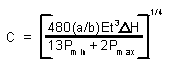
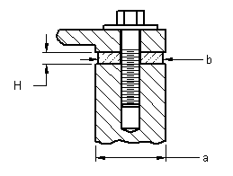
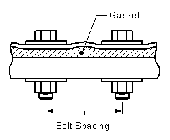
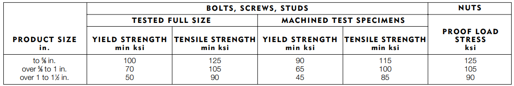
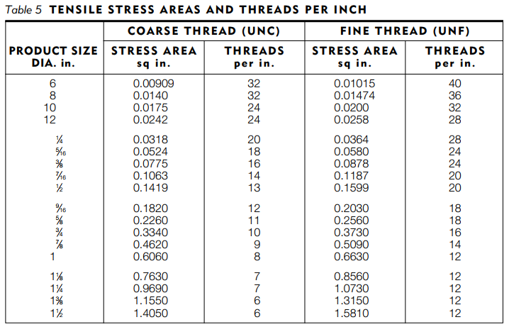
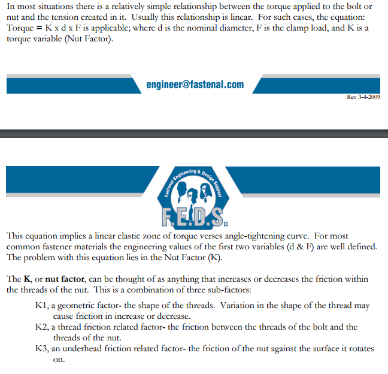
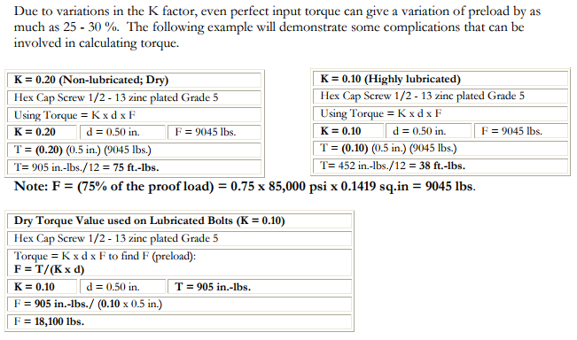

# Gasket Design

The gasket's function is to prevent leakage through the outer seams of the OWL300. To prevent leaks, the gasket is evenly compressed with angle aluminum angle. The gasket itself is an elastomer that can deform into uneven shapes to prevent leakage. For a gasket to work properly, it needs to be compressed sufficiently and evenly given the gasket material, loading conditions, and other design criteria.

## Design

The chosen design uses aluminum angle iron in all seams of the plant. The aluminum angle iron is inexpensive and rigid enough to ensure even gasket pressure with little thickness.

### Undetermined Variables

The goal in this document is to determine the following variables:

| Variable                 | Explanation                                                                                                     |
| ------------------------ | --------------------------------------------------------------------------------------------------------------- |
| Gasket material          | The material has to withstand the environmental conditions while being inexpensive and provide an adequate seal |
| Angle aluminum thickness | The angle iron has to provide even enough pressure on the gasket to prevent localized leaking                   |
| Angle aluminum Width     | The angle iron width has to be enough to support the compressing bolt adequately                                |
| Bolt diameter            | The bolt diameter should be chosen to support the required loading                                              |
| Bolt spacing             | The bolts should be placed often enough to ensure even enough compression of the gasket                         |

Some of these variables are inextricably linked. For instance, the closer the bolts are spaced, the weaker the aluminum angle iron has to be, and therefore the thickness and the width of the angle will decrease. Therefore, it is necessary to make reasonable choices for some of the variables. The choices made in this document are as follows:

```python
from aide_design.play import *

al_t = 0.125 *u.inch
al_w = 0.75 *u.inch
bolt_d = 0.25 *u.inch
seal_t = 0.060 *u.inch

```
### Material Selection

The most important criteria for gasket material selection was that it is food grade. Secondary considerations were UV-stabilization, compression curves, stress relaxation, and cost. The most readily accessible option that fit all criteria was **EPDM** gasket material. [Here is a convenient table](http://www.excelsiorinc.com/images/pdf/General_properties_of_elastomers.pdf) showing the advantages/disadvantages of some of the most common gasket elastomers.

EPDM-related links:
* [Datasheet on EPDM](http://www.deltarubber.co.uk/pdfs/EPDM-general-purpose.pdf)

### Pressure Required

The first step is to determine the required pressure. The recommended deflection for an EPDM rubber at low pressures is [15%](https://www.rogerscorp.com/documents/2366/designtools/Sealing-Design-Guide.pdf). To achieve 15% compression, EPDM's Young's modulus is used:

```python

epdm_modulus = 5*10**6*u.pascal
seal_compression_ratio_max = 0.4
seal_compression_ratio_min = 0.05
seal_pressure_max = epdm_modulus*seal_compression_ratio_max
seal_pressure_min = epdm_modulus*seal_compression_ratio_min
seal_deflection_max = seal_compression_ratio_max*al_t
seal_deflection_min = seal_compression_ratio_min*al_t
```

### Bolt Frequency

To determine the bolt frequency, the calculation found [here](https://www.engineersedge.com/general_engineering/gasket_cover_compression.htm) was used and is reproduced below:



| Variable | Definition                                      |
| -------- | ----------------------------------------------- |
| a        | = Width of cover / flange plate at seam         |
| b        | = Width of gasket                               |
| C        | = Bolt spacing (in) (see illustration below)    |
| E        | = Modulus of elasticity of cover / flange plate |
| ΔH       | = H2- H1                                        |
| H1       | = Minimum gasket deflection                     |
| H2       | = Maximum  gasket deflection                    |
| Pmin     | = Minimum gasket pressure                       |
| Pmax     | = Maximum gasket pressure                       |
| t        | = Cover / flange thickness                      |



Here is the Python equation we'll use for this equation:

```python
def gasket_bolt_spacing(a, b, E, H_delta, P_min, P_max, t):
  return ((480*(a/b)*E*t**3*(H_delta))/(13*P_min + 2*P_max))**0.25


al_modulus = 68.9 * 10**9 * u.pascal

H_delta = seal_deflection_max-seal_deflection_min

bolt_spacing = gasket_bolt_spacing(al_w, al_w, al_modulus, H_delta, seal_pressure_min, seal_pressure_max, al_t)
print(bolt_spacing)
# >>> 4.58 inch
```

### Bolt Selection

The bolt needed to have a conical head that could seal, be stainless, 1/4"-20 and 3/4" long. Here's what shows up on [McMasterCarr](https://www.mcmaster.com/#standard-flat-head-screws/=1bm8pd8). The most affordable is an undercut Philips-drive.  

### Bolt Force

To calculate the tensile force on each bolt, multiply the area each bolt is responsible for by the seal pressure by 3 because of the 3x pressure load at the bolt head.

```python
bolt_force = al_w*bolt_spacing*(seal_pressure_max+seal_pressure_min)/2*3
print(bolt_force.to(u.newton))
# >>> 7256 newton

stainless_18_8_yield_strength = 65000*u.pound_force_per_square_inch

bolt_yield_strength = bolt_d**2*np.pi/4 * stainless_18_8_yield_strength

bolt_safety_factor = bolt_yield_strength/bolt_force
print(bolt_safety_factor.to(u.dimensionless))
# >>> 1.96
```

The 6096 newton bolt force leaves a safety factor of 2.3. Now the proof load of the nut-bolt threads needs to be determined. From [here](http://www.ssina.com/download_a_file/fasteners.pdf) it is clear that the thread cross-sectional area should be multiplied by the proof load pressure to get the stripping strength. The following are copied tables pertaining to 18-8 stainless steel:




```python
def bolt_proof_load(proof_load_stress, thread_stress_area):
  return (proof_load_stress*thread_stress_area).to(u.newton)

proof_load_stress = 125* 10**3 * u.pound_force_per_square_inch
thread_stress_area = 0.0318 * u.sq_in

bolt_proof_load = bolt_proof_load(proof_load_stress, thread_stress_area)
print(bolt_proof_load)

# >>> 1.768e+04 newton

thread_safety_factor = bolt_proof_load/bolt_force
print(thread_safety_factor.to(u.dimensionless))

# >>> 2.4
```

Looks like the bolt would break before the threads would slip, and with the 4.9 safety factor, the design is well within limits.

### Bolt Tightening Torque

To determine the torque required to properly tighten the load, a [linearly-elastic model with a k factor was used.](https://www.fastenal.com/content/feds/pdf/Article%20-%20Bolted%20Joint%20Design.pdf)




Below is an attempt to determine a conservative torque estimate:

```python
torque = bolt_d*bolt_force*0.20
print(torque.to(u.inch*u.pound_force))

# >>> 81.56 force_pound * inch
```

From a [standard table of proper torques](https://spaenaur.com/pdf/sectionD/D48.pdf), this value checks out.
