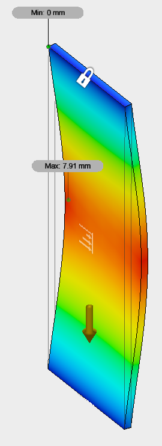
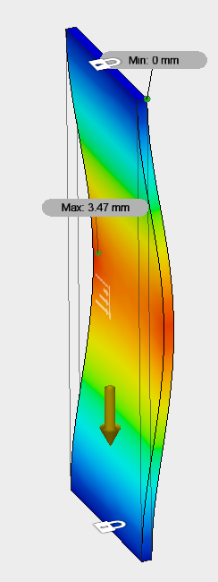

# Calculating Rib Spacing

The goal is to have ribs spaced often enough to minimize the deflection in the plate in between the ribs.

After an attempt to use python to solve the rib spacing problem, I gave up because my results were not agreeing with Fusion 360's results with their static analysis solver. Their results were more reasonable, so I'm using those to determine the rib spacing.

My new method is to take a guess and test that guess within Fusion360. After a few tests, I come up with an empirical equation that relates rib spacing to center plate deflection at the surface.

## With end Edges Bound



```python
from aide_design.play import *

d = {'spacing (m)': [0.1, 0.2, 0.3, 0.4, 0.5], 'deflection (mm)': [0.12, 1.7, 7.91, 23.79, 54.47]}
df = pd.DataFrame(data=d)
z = np.polyfit(x=df.loc[:, "spacing (m)"], y=df.loc[:, "deflection (mm)"], deg=3)
deformation_with_edges = np.poly1d(z)
df['trendline'] = deformation_with_edges(df.loc[:, "spacing (m)"])
print(df)
```

## With the End Planes Bound

If I do the same experiment, but constrain the end planes such that they are held horizontally at the end, the deflections are halved. Maybe this is a better model because each attaching section of plate helps hold the end horizontally.



The following is the same empirical equation but with the new constraint.

```python
d_planes = {'spacing (m)': [0.1, 0.2, 0.3, 0.4, 0.5], 'deflection (mm)': [0.0542, 0.7586, 3.47, 10.46, 23.94]}
df_planes = pd.DataFrame(data=d_planes)
z_planes = np.polyfit(x=df_planes.loc[:, "spacing (m)"], y=df_planes.loc[:, "deflection (mm)"], deg=3)
deformation_with_planes = np.poly1d(z_planes)
df_planes['trendline'] = deformation_with_planes(df_planes.loc[:, "spacing (m)"])
print(df_planes)
```

## Adding Water Depth

Since the deformation increases linearly with force applied, and since similarly the total force applied increases linearly with water depth, it stands to reason that we can add the force due to depth to the equation. To do this, I need to determine a relationship between depth in water and deformation. I do so with the same guess-and-check system as before:

```python
d_planes = {'distance under water (m)': [0, 0.25, 0.5, 0.75, 1], 'deflection (mm)': [0.07024, 2.458, 0.4215, 10.46, 23.94]}
df_planes = pd.DataFrame(data=d_planes)
z_planes = np.polyfit(x=df_planes.loc[:, "spacing (m)"], y=df_planes.loc[:, "deflection (mm)"], deg=3)
deformation_with_planes = np.poly1d(z_planes)
df_planes['trendline'] = deformation_with_planes(df_planes.loc[:, "spacing (m)"])
print(df_planes)
```

##
